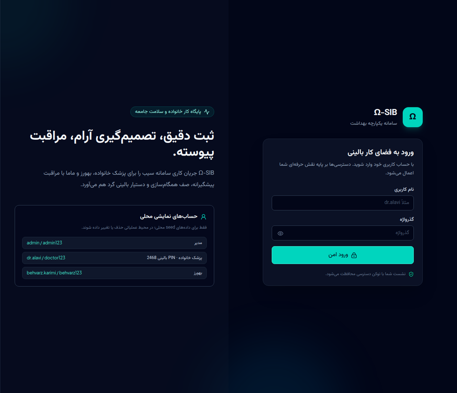
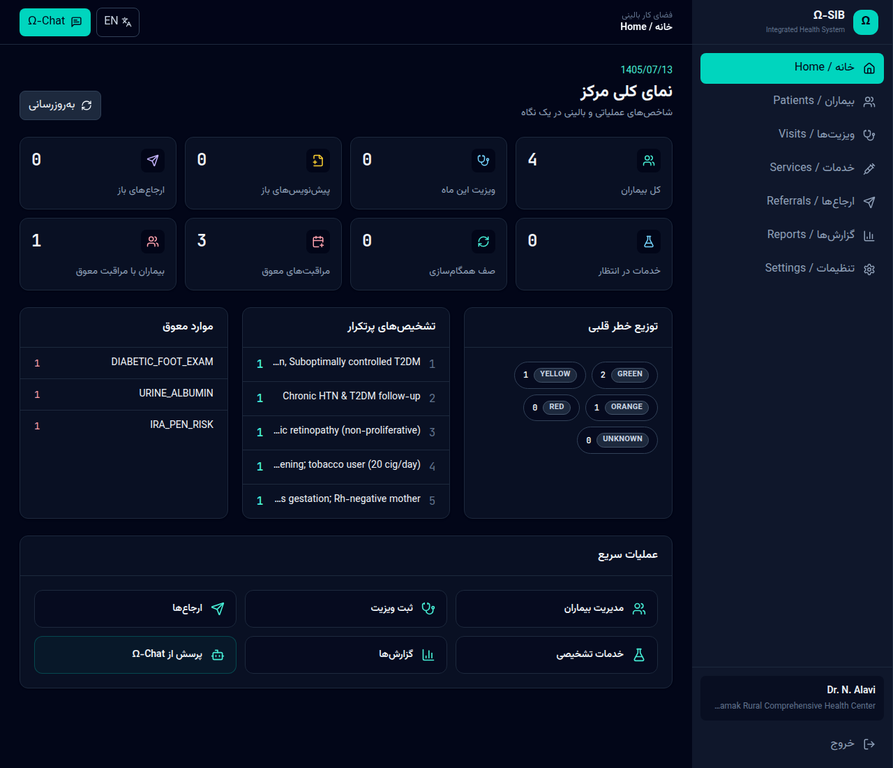
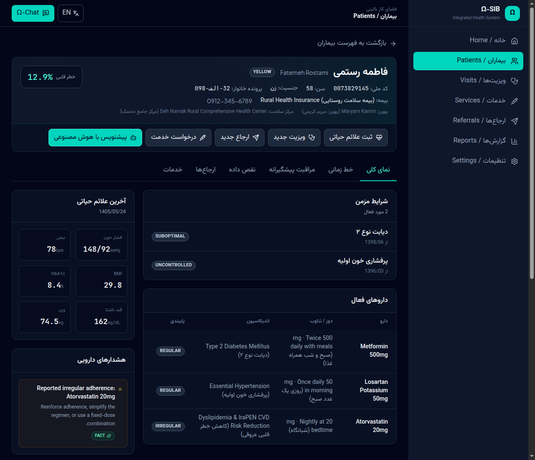
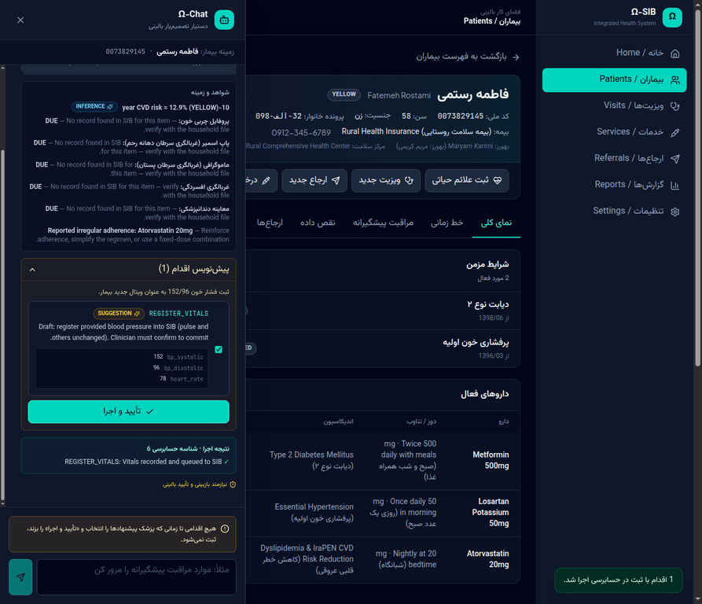

# Ω-SIB — SIB-Compatible Clinical Web App + API + AI Interface

> **Same workflow. Smarter tools. Better support for you.**
> A reliable, independent and intelligent interface that replicates the SIB system, while adding AI-powered assistance, a clean API and a flexible platform for future integrations.

Ω-SIB (Omega-SIB) is a complete, self-hostable clinical workspace for **family physicians (پزشک خانواده)**, **Behvarz community health workers (بهورز)** and **midwives (ماما)** working inside Iran's Integrated Health System — **SIB / سامانه یکپارچه بهداشت**.

It reproduces the SIB workflow — household file (پرونده خانوار), patient panel, visits (ویزیت), services (خدمات), referrals (ارجاع), preventive care and data-quality control — on an open, modular stack with:

- a **REST/JSON API** you can integrate with anything,
- a **deterministic clinical rules engine** (IraPEN-style cardiovascular risk, national screening intervals, drug-safety checks, SIB data-quality auditing) that always works, even offline,
- an **AI assistant (Ω-Chat)** that is *grounded* in the record and can only propose **drafts** — the clinician confirms, then it executes and audits.

---

## Table of contents

- [Why](#why)
- [Feature map](#feature-map)
- [Architecture](#architecture)
- [Quick start](#quick-start)
- [Demo accounts](#demo-accounts)
- [Walkthrough: a complete clinical workflow](#walkthrough-a-complete-clinical-workflow)
- [The AI interface (Ω-Chat)](#the-ai-interface-ω-chat)
- [The clinical rules engine](#the-clinical-rules-engine)
- [API surface](#api-surface)
- [Repository layout](#repository-layout)
- [Testing](#testing)
- [Docker / PostgreSQL](#docker--postgresql)
- [Clinical safety, privacy and limitations](#clinical-safety-privacy-and-limitations)
- [Roadmap](#roadmap)
- [Documentation](#documentation)

---

## Why

SIB is the operational backbone of primary care in Iran, but its workflow is form-heavy and its data is fragmented. Ω-SIB keeps the familiar workflow (so nothing has to be relearned) and adds the things the daily work actually needs:

| Problem in daily practice | What Ω-SIB does |
| --- | --- |
| Preventive-care due dates are easy to miss across a panel | A per-patient care-gap schedule (BP, FBS, HbA1c, lipids, BMI, Pap, mammography, colorectal, dental, depression, vaccination, medication review) with `UP_TO_DATE / DUE / OVERDUE` and the guideline behind each rule |
| Risk stratification is manual | An explicit, transparent IraPEN-style 10-year cardiovascular risk score with its colour band and the contribution of every factor |
| Medication safety is checked by memory | Interaction, duplicate-therapy, adherence and monitoring alerts with a recommendation each |
| Records contain contradictions | A data-quality audit (invalid national ID, impossible blood pressure, stale vitals, missing fields, uncommitted drafts) with the exact SIB location and a suggested correction |
| Notes are typed twice | Ω-Chat turns a sentence — in Persian or English — into a reviewable draft (vitals, visit, referral, service request) |
| Connectivity is unreliable | A SIB sync queue with `QUEUED / SYNCING / SYNCED / FAILED`, retries and a pluggable adapter |

---

## Feature map

| Module | Persian | What it does |
| --- | --- | --- |
| Home | خانه | Practice dashboard: panel size, visits this month, uncommitted drafts, open referrals, pending services, sync queue, risk distribution, top diagnoses |
| Patients | بیماران | Search by name / national ID / phone / household file; full chart with conditions, medication profile, vitals history, encounter timeline, care gaps, quality findings, referrals and services |
| Visits | ویزیتها | Structured visit capture (SOAP + vitals + prescriptions + lab orders + referral), **draft → commit** with clinical e-signature PIN, then SIB sync |
| Services | خدمات | National service catalogue (labs, imaging, screening, vaccination, counselling) with request tracking and instructions |
| Referrals | ارجاعها | Referral slips with specialty-specific pre-referral workup checklists, urgency, status tracking and a printable slip |
| Reports | گزارشها | Practice KPIs, care-gap worklist, data-quality report (identity, completeness, live findings) |
| Settings | تنظیمات | Clinician profile, AI engine status, SIB bridge status, sync queue with retry/flush, append-only audit log |
| Ω-Chat | دستیار هوشمند | Grounded natural-language assistant with a draft → confirm → execute → audit workflow |

## Screenshots

All screenshots are from the running application (Persian RTL-first UI, English toggle available in the header).

| Sign in | Practice dashboard |
| --- | --- |
|  |  |

| Patient chart — conditions, medication profile, vitals, drug alerts and prioritised suggestions with provenance | Ω-Chat — grounded answer, evidence and the draft plan awaiting clinician confirmation |
| --- | --- |
|  |  |

---

## Architecture

```
Doctor / Behvarz / Midwife
        │  (browser, Persian RTL or English)
        ▼
┌───────────────────────────────────────────────┐
│ Ω-SIB Frontend — React 19 + TypeScript + Vite │  UI/UX clone of SIB: forms,
│ sidebar modules · patient chart · Ω-Chat      │  tables, validation, multi-device
└───────────────────────────────────────────────┘
        │  REST / JSON  ·  Bearer JWT
        ▼
┌───────────────────────────────────────────────┐
│ API layer — FastAPI                           │  authentication · validation ·
│ OpenAPI at /docs · RBAC by capability         │  rate limiting (edge) · CORS
└───────────────────────────────────────────────┘
        │
        ▼
┌───────────────────────────────────────────────┐
│ Backend services                              │
│  patient · encounter · referral · service     │
│  catalogue · search & reporting · audit       │
│  clinical rules engine · Ω-Chat · SIB bridge  │
└───────────────────────────────────────────────┘
        │                                  │
        ▼                                  ▼
┌──────────────────────┐        ┌──────────────────────────┐
│ Database             │        │ External connections     │
│ SQLite (dev)         │        │ SIB adapter (simulator / │
│ PostgreSQL (prod)    │        │ HTTP gateway) · labs ·   │
│ audit + sync queue   │        │ imaging · notifications  │
└──────────────────────┘        └──────────────────────────┘
   Cross-cutting: security · logging · monitoring · audit
```

Full diagrams, the request lifecycle, the provenance model and the sync-queue design are in [`docs/ARCHITECTURE.md`](docs/ARCHITECTURE.md).

---

## Quick start

Requirements: Python 3.11+, Node 20+.

```bash
# 1 — backend
cd backend
pip install -r requirements.txt
python -m app.seed                 # creates the SQLite DB, users, catalogue and demo panel
uvicorn app.main:app --reload --port 8000
#    API docs:  http://localhost:8000/docs

# 2 — frontend (second terminal)
cd frontend
npm install
npm run dev                        # http://localhost:5173  (proxies /api to :8000)
```

Single-origin production run (FastAPI serves the built frontend):

```bash
cd frontend && npm run build        # emits frontend/dist
cd ../backend && SERVE_FRONTEND=true uvicorn app.main:app --port 8000
#    open http://localhost:8000
```

`make install && make seed && make run` does the same thing. See [`docs/DEPLOYMENT.md`](docs/DEPLOYMENT.md) for Docker, PostgreSQL and hardening.

---

## Demo accounts

Created by `python -m app.seed` (change them immediately outside a demo environment):

| Username | Password | Role | Clinical PIN | Capabilities |
| --- | --- | --- | --- | --- |
| `admin` | `admin123` | admin | – | everything |
| `dr.alavi` | `doctor123` | family_physician | `2468` | visits, referrals, services, **commit to SIB**, AI execution, reports |
| `behvarz.karimi` | `behvarz123` | behvarz | – | read + record vitals + request services |
| `midwife.hoseini` | `midwife123` | midwife | – | read + visits + referrals + services |

The seeded panel contains four Persian household files with real-shaped clinical data (diabetes, hypertension, COPD, heart failure, medication profiles, vitals history, visit notes and SIB data-quality findings). National-ID check digits were recomputed for the demo records.

---

## Walkthrough: a complete clinical workflow

1. **Sign in** as `dr.alavi` and open **خانه** — the dashboard shows the panel, today's workload, overdue screening items and the sync queue.
2. Open **بیماران**, search `فاطمه` or a national ID, and open the chart.
3. **نمای کلی** shows the chronic conditions with control status, the medication profile, the latest vitals, drug alerts and the prioritised suggestions — each with a provenance badge telling you whether it is a **FACT** read from the record, an **INFERENCE** derived from it, or a **SUGGESTION** added by the rules engine.
4. Open **مراقبت پیشگیرانه** — every screening and follow-up item with `UP_TO_DATE / DUE / OVERDUE`, the last-done and next-due Jalali dates and the national programme behind the interval.
5. Open **نقص داده** — the SIB data-quality findings, each with its location in SIB and a suggested correction; resolve them one by one (every action is audited).
6. Click **ویزیت جدید**, capture the complaint, vitals, assessment, plan, prescriptions and lab orders, then **ذخیره پیشنویس**. The visit is a draft — nothing has left the building.
7. Click **تأیید و ارسال به سیب** and enter the clinical PIN `2468`. Ω-SIB builds the SIB transaction, pushes it through the bridge and marks the visit `COMMITTED`; the queue row is visible in **تنظیمات** with its summary and status.
8. Create a **ارجاع** to Cardiology — the specialty workup checklist is attached automatically, the slip can be printed, and the referral is tracked through `DRAFT → SENT → ACCEPTED → COMPLETED`.
9. Request a service (**خدمات**) such as `LAB-HBA1C`; the catalogue returns fasting requirements, instructions and turnaround time.
10. Ask **Ω-Chat**: *«فشار خون ۱۵۰ روی ۹۵ و قند ناشتا ۱۴۲ را ثبت کن»* → the assistant returns a **draft plan** with the parsed values, provenance and evidence from the record. Nothing is written until you press **تأیید و اجرا** — and then the write is audited.
11. Check **گزارشها** for the practice KPIs, the care-gap worklist and the data-quality report, and **تنظیمات → گزارش حسابرسی** for the append-only audit trail of everything above.

---

## The AI interface (Ω-Chat)

Ω-Chat is deliberately constrained, because it operates on patient data:

1. **Grounded input.** The request carries a compact patient brief produced by the rules engine (`patient_brief`) — conditions, medication profile, latest vitals, recent visits, care gaps, open data issues, risk estimate and drug alerts. The model is instructed never to invent clinical values.
2. **Draft only.** The model may only emit actions from a fixed catalogue (`REGISTER_VITALS`, `CREATE_ENCOUNTER`, `CREATE_REFERRAL`, `REQUEST_SERVICE`, `RESOLVE_QUALITY_ISSUE`, `SYNC_FLUSH`, plus the read-only `SUMMARIZE_PATIENT`, `GET_RISK`, `SEARCH_PATIENTS`). Unknown action types are rejected by the executor.
3. **Explicit confirmation.** `POST /api/ai/chat` never writes. The clinician selects which actions to run and calls `POST /api/ai/execute`, which performs them and writes one audit row per action plus a summary row.
4. **Provenance everywhere.** Every answer and every action carries `FACT / INFERENCE / SUGGESTION / UNKNOWN`, its source and a confidence value, rendered as a badge in the UI.
5. **Graceful degradation.** With no `AI_API_KEY`, the assistant answers from the deterministic rules engine (`engine: "rules"`) — Persian and English keyword intents, Persian-digit parsing and numeric extraction still work. Configure `AI_BASE_URL`, `AI_API_KEY` and `AI_MODEL` to switch to any OpenAI-compatible model; the response is requested with a strict JSON schema.

Example (rules engine, no key configured):

```bash
curl -s localhost:8000/api/ai/chat -H "Authorization: Bearer $TOKEN" -H 'Content-Type: application/json' \
  -d '{"message":"فشار خون ۱۵۰ روی ۹۵ و قند ناشتا ۱۴۲ را ثبت کن","patient_id":"p-01"}' | jq
```

```json
{
  "intent": "REGISTER_VITALS",
  "engine": "rules",
  "requires_confirmation": true,
  "draft_plan": {
    "actions": [
      {
        "type": "REGISTER_VITALS",
        "params": {"bp_systolic": 150, "bp_diastolic": 95, "fasting_blood_sugar": 142},
        "provenance": {"type": "INFERENCE", "sourceSystem": "Ω-SIB offline parser", "confidence": 0.8}
      }
    ]
  }
}
```

---

## The clinical rules engine

All clinical logic is deterministic, readable and auditable — no model is involved. It lives in `backend/app/services/clinical_rules.py`.

- **Cardiovascular risk** — an explicit additive score over age, sex, systolic blood pressure, smoking, diabetes, total cholesterol, BMI and established cardiovascular disease, mapped to `GREEN / YELLOW / ORANGE / RED`, with the contribution of every factor returned so the clinician can see *why*. It is a decision-support estimate: it does **not** replace the official IraPEN chart.
- **Preventive-care schedule** — blood pressure (6/12 months), fasting glucose (3/6/12 months), HbA1c (3/6 months), lipids (12 months), BMI (12 months), Pap smear (women 30–65, 36 months), mammography (women 40–69, 24 months), colorectal screening (50–70, 24 months), dental (12 months), depression screening (12 months), influenza vaccine (annual for ≥60 or chronic disease), tetanus (120 months), medication review (6/12 months). Each item returns its status, last-done, next-due, the interval and the guideline it came from.
- **Drug safety** — interaction pairs (anticoagulant + NSAID, RAS blocker + potassium-sparing diuretic, statin + fibrate, SSRI + NSAID, SSRI + triptan, digoxin + amiodarone, beta-blocker + non-DHP calcium channel blocker, corticosteroid + NSAID, corticosteroid + glucose-lowering), duplicate therapy, metformin with pending contrast imaging, and adherence findings from the household file.
- **Data-quality audit** — national-ID check digit, missing phone / household number / birth date, stale vitals, impossible blood-pressure pairs, implausible heart rate and BMI, medication without indication, metformin without glycaemic monitoring, and visits left uncommitted.

Every rule output is a `SUGGESTION` or `INFERENCE` that requires clinician confirmation — never an automatic change to the record.

---

## API surface

Base path `/api`, JSON, `Authorization: Bearer <token>`. Interactive docs at `/docs`, schema at `/openapi.json`.

| Group | Endpoints |
| --- | --- |
| Auth | `POST /auth/login` · `GET /auth/me` · `GET /auth/capabilities` · `POST /auth/change-password` |
| Patients | `GET/POST /patients` · `GET/PATCH /patients/{id}` · `GET/POST /patients/{id}/vitals` · `GET /patients/{id}/encounters` · `GET /patients/{id}/preventive-care` · `GET /patients/{id}/quality-issues` · `POST /patients/{id}/quality-issues/audit` · `POST /patients/{id}/quality-issues/{issue_id}/resolve` · `GET /patients/{id}/risk` · `GET /patients/{id}/suggestions` |
| Visits | `GET/POST /encounters` · `GET /encounters/{id}` · `POST /encounters/{id}/commit` · `GET /encounters/{id}/sync-transactions` |
| Referrals | `GET/POST /referrals` · `GET/PATCH /referrals/{id}` · `GET /referrals/{id}/slip` |
| Services | `GET/POST /services` · `GET/POST /service-requests` · `PATCH /service-requests/{id}` |
| Reports | `GET /reports/summary` · `GET /reports/care-gaps` · `GET /reports/data-quality` |
| Sync & audit | `GET /sync/queue` · `GET /sync/status` · `POST /sync/queue/{id}/retry` · `POST /sync/flush` · `GET /audit` |
| AI | `POST /ai/chat` · `POST /ai/execute` · `GET /ai/status` · `GET /ai/actions` · `GET /ai/history` |
| System | `GET /health` · `GET /meta` |

Full reference with request/response examples: [`docs/API.md`](docs/API.md).

---

## Repository layout

```
.
├── backend/                    FastAPI application
│   ├── app/
│   │   ├── main.py             app factory, health/meta, optional static serving
│   │   ├── config.py           environment-driven settings
│   │   ├── database.py         engine/session (SQLite ↔ PostgreSQL)
│   │   ├── models.py           SIB domain model + audit log + sync queue
│   │   ├── schemas.py          Pydantic API contract
│   │   ├── security.py         JWT, bcrypt, role capabilities
│   │   ├── audit.py            append-only audit trail
│   │   ├── serializers.py      chart / list payload shaping
│   │   ├── seed.py             users, service catalogue, demo panel
│   │   ├── utils.py            Jalali calendar, age, national-ID validation
│   │   ├── data/seed_patients.json
│   │   ├── routers/            auth, patients, encounters, referrals, services, reports, sync, ai
│   │   └── services/           clinical_rules · ai · sib_bridge
│   ├── tests/                  pytest suite (55 tests, offline)
│   └── requirements.txt
├── frontend/                   React 19 + TS + Vite + Tailwind (Persian RTL-first)
├── legacy-prototype/           the original single-page prototype, kept for reference
├── docs/                       architecture, API, security, deployment, roadmap
├── .github/workflows/ci.yml    CI: backend pytest + frontend build
├── Dockerfile · docker-compose.yml · Makefile
└── .env.example
```

---

## Testing

```bash
cd backend && python -m pytest tests -q      # 55 tests, no network required
cd frontend && npm run lint && npm run build
```

The suite covers the calendar and national-ID helpers, every clinical rule family, authentication and RBAC, the patient chart, the visit → commit → sync workflow, referrals and slips, services, reporting, the AI draft/execute contract and its audit trail. The tests run with the AI credentials removed from the environment, which is exactly how the rules-engine fallback is exercised.

---

## Docker / PostgreSQL

```bash
cp .env.example .env         # set SECRET_KEY and, for production, DATABASE_URL
docker compose up --build    # api on :8000, postgres 16 on :5432
docker compose exec api python -m app.seed
```

The ORM models are database-agnostic: set `DATABASE_URL=postgresql+psycopg://…` and the same schema, queries and tests apply. See [`docs/DEPLOYMENT.md`](docs/DEPLOYMENT.md).

---

## Clinical safety, privacy and limitations

- Ω-SIB is **clinical decision support**, not a diagnostic device. Every rule output, risk score and AI answer is a suggestion that requires clinician confirmation; the risk model is a simplified, transparent implementation and does not replace the official IraPEN chart.
- The demo panel is synthetic-shaped sample data derived from the original prototype. Do not load real patient data into a demo deployment.
- Default credentials and `SECRET_KEY` are for development only; rotate them, terminate TLS at the edge, and run with `APP_ENV=production` behind a reverse proxy.
- The audit log is append-only by convention (the API exposes no update/delete for it); for regulatory use, add database-level permissions and periodic export.
- The SIB adapter ships as a **simulator**. Production requires a real SIB gateway URL and token, plus a formal interface agreement with the national system owner.
- Honest gaps: no FHIR/HL7 mapping yet, no migration tooling beyond `create_all`, no refresh-token rotation, no offline PWA cache, and no integration with laboratory or imaging result feeds. These are tracked in [`docs/ROADMAP.md`](docs/ROADMAP.md).

Security details and the role/capability matrix: [`docs/SECURITY.md`](docs/SECURITY.md) and [`SECURITY.md`](SECURITY.md).

---

## Roadmap

| Phase | Focus | Status |
| --- | --- | --- |
| 1 — Reverse specification | analyse SIB screens and workflows, document them, define models and the API contract | **Delivered** — models, contract and docs are in this repository |
| 2 — UI + backend clone | familiar UI, core services, database, basic testing | **Delivered** — patients, visits, services, referrals, reports, settings |
| 3 — AI interface & tools | natural language, workflow mapping, draft + confirm flow | **Delivered** — Ω-Chat with grounded drafts, confirmation and auditing |
| 4 — Integration & testing | end-to-end tests, security, performance, feedback | **Partially delivered** — 55 backend tests, RBAC and audit in place; load testing and penetration testing remain |
| 5 — Production & expansion | real SIB adapter, advanced features, mobile, continuous improvement | **Not started** — requires the national interface agreement |

Details: [`docs/ROADMAP.md`](docs/ROADMAP.md).

---

## Documentation

| Document | Contents |
| --- | --- |
| [`docs/ARCHITECTURE.md`](docs/ARCHITECTURE.md) | Layered architecture, request lifecycle, provenance model, sync-queue design, SIB adapter swap-in |
| [`docs/API.md`](docs/API.md) | Endpoint reference with examples, errors, pagination, curl quickstart |
| [`docs/SECURITY.md`](docs/SECURITY.md) | JWT, RBAC matrix, audit immutability, encryption, backup, production gaps |
| [`docs/DEPLOYMENT.md`](docs/DEPLOYMENT.md) | Local, Docker, PostgreSQL, environment variables, backups, hardening |
| [`docs/ROADMAP.md`](docs/ROADMAP.md) | The five phases with deliverables and remaining work |
| [`CONTRIBUTING.md`](CONTRIBUTING.md) | Branching, commits, PR checklist, clinical-safety review rule |

---

*Built for the daily reality of primary care: familiar workflow, fewer clicks, more care.*
*Clinical Knowledge + Intelligent Systems = Greater Impact.*
