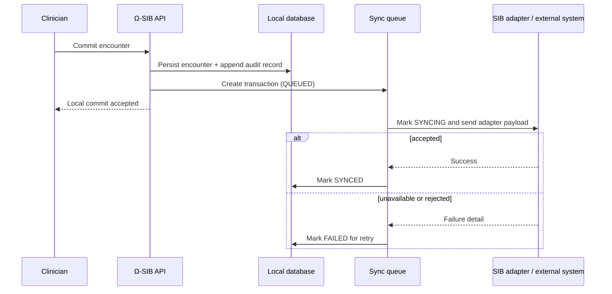

# Ω-SIB Architecture

Ω-SIB is a **SIB-compatible clinical web application and REST API** for family physicians (general practitioners) in Iran. It reproduces the core workflows of the national Integrated Health System (SIB; سامانه یکپارچه بهداشت) in an open, modular stack, while adding an AI assistant and deterministic clinical decision support. The product is Persian/RTL-first, with English as a secondary language.

> **Scope note:** Ω-SIB is designed to be SIB-compatible. It is not represented here as a live connection to a national SIB environment. The SIB adapter is deliberately pluggable and remains a future integration boundary.

## System at a glance

```mermaid
flowchart LR
    U[User / Doctor] --> FE

    subgraph FE[Ω-SIB Frontend]
      F1[UI/UX clone of SIB]
      F2[Forms & tables]
      F3[Validation]
      F4[Multi-device, Persian RTL-first]
    end

    FE --> API

    subgraph API[API Layer]
      A1[REST / JSON]
      A2[Bearer-JWT authentication]
      A3[Data validation]
      A4[Rate limiting]
    end

    API --> SVC

    subgraph SVC[Backend Services]
      B1[Patient]
      B2[Encounter]
      B3[Referral]
      B4[Service catalog]
      B5[Search & reporting]
      B6[Audit & logging]
      B7[AI abstraction + deterministic rules]
      B8[Sync queue]
    end

    SVC --> DB

    subgraph DB[Database]
      D1[SQLite — development]
      D2[PostgreSQL — production]
      D3[Encrypted storage configured by deployment]
      D4[Backup & restore]
    end

    SVC --> EXT

    subgraph EXT[External Connections]
      E1[Future SIB adapter]
      E2[Other systems]
      E3[Labs / imaging]
      E4[Notifications]
    end

    X[Cross-cutting: Security · Logging · Monitoring · Audit]
    X -. protects and observes .-> FE
    X -. protects and observes .-> API
    X -. protects and observes .-> SVC
    X -. protects and observes .-> DB
```

## Layers and responsibilities

| Layer | Responsibility | Primary technologies |
|---|---|---|
| **Frontend** | Presents SIB-compatible workflows for household files (پرونده خانوار), patients, visits (ویزیت), services (خدمات), referrals (ارجاع), reports, and settings. It provides Persian RTL-first layout, form validation, data tables, and the Ω-Chat panel. | React 19, TypeScript, Vite, Tailwind CSS v4, Vazirmatn |
| **API layer** | Exposes the versioned application surface under `/api`, authenticates Bearer JWTs, validates JSON request models, and provides a boundary for rate limiting and access control. | FastAPI, Pydantic v2 |
| **Domain services** | Coordinates patients, encounters, vitals, referrals, service requests, reporting, clinical rules, audits, and sync work. | Python 3.12, SQLAlchemy ORM |
| **Persistence** | Uses the same ORM models with SQLite during development and PostgreSQL in production, selected through `DATABASE_URL`. It holds operational data, the append-only audit log, and queued synchronization transactions. | SQLite / PostgreSQL |
| **Integration boundary** | Isolates SIB-specific payload translation and transport behind an adapter so the clinical application can operate without a live SIB dependency. Future adapters can also address laboratories, imaging, notifications, and other systems. | Pluggable adapter interface |
| **AI and rules** | Sends chat-completions requests through an OpenAI-compatible provider when configured, while deterministic offline clinical rules remain available without an AI key. | `AI_BASE_URL`, `AI_API_KEY`, `AI_MODEL`; rules engine |

## Request lifecycle

1. A clinician signs in and the frontend stores and presents the issued Bearer access token according to the application's session design.
2. The frontend submits JSON to an `/api` endpoint. Client-side validation improves usability; the API's Pydantic validation remains authoritative.
3. FastAPI authenticates the JWT and applies the caller's role (`family_physician`, `behvarz`, `midwife`, or `admin`) before a service performs the requested operation.
4. The domain service reads or writes through SQLAlchemy. Every clinical write is recorded in the append-only audit log.
5. For decision support, the service may calculate an IraPEN-style cardiovascular-risk result, preventive-care schedule, drug-interaction check, or data-quality finding deterministically. AI chat is accessed only through the configured provider abstraction and can fall back to offline rules when no key is configured.
6. The API returns JSON. Clinical write paths that must be propagated to SIB can create a queued synchronization transaction rather than coupling the clinician's workflow to an external system's availability.

## Provenance and AI action control

Every AI output is labelled in the frontend with one of the following badges:

| Badge | Meaning | Safe use |
|---|---|---|
| **FACT** | Information directly grounded in available patient or system data. | Verify that the displayed source data are current. |
| **INFERENCE** | A conclusion drawn from available information. | Treat as clinical decision support, not an autonomous decision. |
| **SUGGESTION** | A proposed next action or draft. | Review and edit before acting. |
| **UNKNOWN** | The system cannot establish the requested answer from available information. | Obtain or verify the missing information. |

AI actions do not silently alter a chart. The intended control path is **draft → review → confirm → execute → audit**. `POST /api/ai/chat` can return a draft plan and whether confirmation is required; `POST /api/ai/execute` executes confirmed actions and returns an audit identifier. The deterministic rules engine is intentionally separate from generative output so important offline guidance does not depend on a provider key or model response.

## Offline sync-queue design

Ω-SIB separates a completed local clinical operation from external synchronization:

A transaction moves through **`QUEUED` → `SYNCING` → `SYNCED`** on success, or to **`FAILED`** on error. Authorized users can retry an individual queue item or request a queue flush through the sync endpoints. The design preserves local auditability and makes failures visible; it does not imply that automatic retry, ordering, idempotency semantics, or a live SIB transport have been certified beyond the implementation exposed by the current backend.

## Moving from a local queue to a production SIB adapter

The application service should depend on an adapter contract, not on SIB transport details. A production implementation can be introduced without changing patient, encounter, referral, or audit service interfaces:

1. Define an adapter implementation that maps canonical Ω-SIB records into the required SIB transaction format.
2. Configure authenticated transport, timeouts, retry classification, and secure credential handling outside source control.
3. Send each committed queue item through that adapter and persist the external receipt, error detail, and state transition.
4. Make requests idempotent where the external protocol permits it, so retrying a `FAILED` item does not create duplicate clinical activity.
5. Validate mappings, user permissions, error handling, and reconciliation rules in an authorized non-production environment before any live rollout.

This approach also permits separate adapters for laboratories, imaging providers, notifications, or other Iranian health-system integrations. Each adapter must preserve the same authorization, minimization, audit, and failure-visibility expectations as the core service.

## Operational boundaries

- **Development:** SQLite is suitable for local development and test workflows. Use PostgreSQL for production concurrency, backup operations, and managed durability.
- **Encryption:** database engines and containers do not make data encrypted merely by naming a volume. Encryption at rest, encrypted backups, key management, and TLS termination must be configured by the production deployment. See [Security](SECURITY.md) and [Deployment](DEPLOYMENT.md).
- **Monitoring:** the architecture reserves cross-cutting logging and monitoring boundaries. Production alert thresholds, retention, and monitoring integrations are deployment decisions and should not expose clinical data in logs.
- **Clinical safety:** decision support assists licensed clinicians; it must not be treated as a replacement for clinical judgement, local policy, or guideline review.
