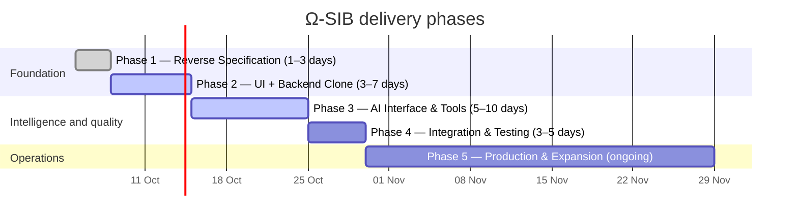

# Ω-SIB Roadmap

Ω-SIB is planned as a staged effort to reproduce SIB-compatible family-physician workflows, add a clean REST API and safe AI assistance, and then prepare integrations for production use. Durations are planning ranges, not guarantees; clinical validation, approvals, and integration access can change sequencing.

## Phase overview

## Phase 1 — Reverse Specification

**Duration:** 1–3 days  
**Goal:** Turn observed SIB workflows and domain terminology into an explicit, testable product specification.

| Status | Deliverables |
|---|---|
| **Delivered in the current product definition** | Persian/RTL-first target, core navigation, and key vocabulary: household file (پرونده خانوار), Behvarz (بهورز), health house (خانه بهداشت), comprehensive health center, visit (ویزیت), referral (ارجاع), services (خدمات), health insurance, and national ID (کد ملی). The SIB-compatible but independently operated positioning is also defined. |
| **Remain** | Validate field-level workflow details, permissions, local policies, and terminology with intended users; maintain a traceable specification for every future integration mapping. |

## Phase 2 — UI + Backend Clone

**Duration:** 3–7 days  
**Goal:** Deliver a modern clone of the principal SIB clinical workflows with durable API and persistence boundaries.

| Status | Deliverables |
|---|---|
| **Delivered / present in the stated current stack** | React 19, TypeScript, Vite, Tailwind CSS v4, Vazirmatn, Persian RTL-first UI, the sidebar workflow shell, FastAPI, SQLAlchemy, Pydantic v2, SQLite development and PostgreSQL production configuration, JWT bearer authentication, bcrypt hashes, four roles, REST resources for patients, encounters, vitals, referrals, service requests, reports, sync, audit, and health. |
| **Remain** | Complete user-acceptance testing against the reverse specification, validate every form and table workflow across devices, and verify role and record-scope enforcement in the deployed environment. |

## Phase 3 — AI Interface & Tools

**Duration:** 5–10 days  
**Goal:** Add useful clinical assistance without making generative output an unreviewed clinical action.

| Status | Deliverables |
|---|---|
| **Delivered / present in the stated current stack** | Ω-Chat, an OpenAI-compatible chat-completions abstraction (`AI_BASE_URL`, `AI_API_KEY`, `AI_MODEL`), deterministic offline rules fallback, IraPEN-style cardiovascular-risk endpoint, preventive-care and quality-issue views, rules suggestions, drug-interaction checks, provenance labels (**FACT**, **INFERENCE**, **SUGGESTION**, **UNKNOWN**), and the draft → review → confirm → execute → audit model. |
| **Remain** | Clinical governance for rule content, scenario-based safety testing, confirmation-path usability testing, provider privacy review, and ongoing evaluation of AI responses with representative but properly protected data. |

## Phase 4 — Integration & Testing

**Duration:** 3–5 days  
**Goal:** Exercise the system as an interoperable service and make failures visible and recoverable.

| Status | Deliverables |
|---|---|
| **Delivered / present in the stated current stack** | Append-only clinical-write audit records, a pluggable adapter boundary, and a synchronization queue with `QUEUED`, `SYNCING`, `SYNCED`, and `FAILED` states plus retry and flush API operations. Pytest is the backend test framework. |
| **Remain** | Implement and authorize a real SIB adapter; test payload mappings, retries, idempotency, reconciliation, laboratories/imaging/notification integrations where needed, end-to-end API/UI tests, load testing, and operational failure drills. |

## Phase 5 — Production & Expansion

**Duration:** ongoing  
**Goal:** Operate Ω-SIB safely at production quality and expand through independently maintainable integrations and workflows.

| Status | Deliverables |
|---|---|
| **Delivered / present in this documentation layer** | Container build, local compose topology, CI baseline, deployment guidance, security guidance, contribution rules, and an API/architecture reference. |
| **Remain** | Production PostgreSQL operations, TLS, encrypted storage and backups, secret management, monitoring/alerting, audited access administration, disaster-recovery exercises, regulatory and privacy approvals, clinical safety governance, live integration onboarding, and controlled expansion to additional services. |

## Completion criteria by phase

A phase should be considered complete only when its artifact is demonstrated, reviewed by the accountable stakeholder, and reflected in tests or an operational runbook as appropriate. In particular:

- A visual clone is not enough without workflow and authorization validation.
- A rules or AI feature is not complete without clinical review and clear provenance/confirmation behavior.
- A queue is not an integration until its adapter, error handling, retry safety, and reconciliation have been validated.
- A containerized application is not production-ready without the controls described in [Security](SECURITY.md) and [Deployment](DEPLOYMENT.md).
